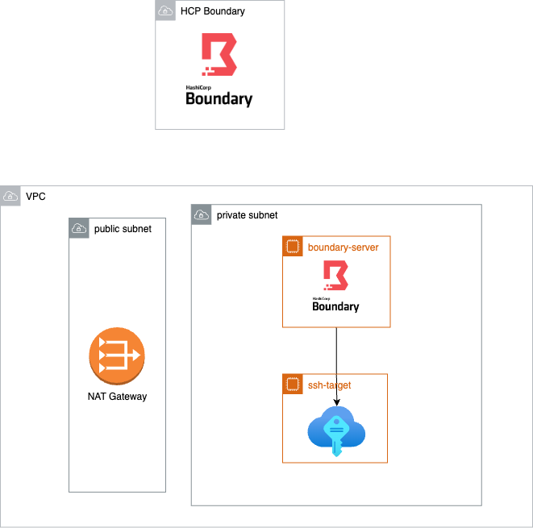

# Boundary sandbox

Minimal setup for testing out HCP Boundary multi-hop feature with SSH credentials injection


## Pre-req
- Terraform
- AWS account with CLI access
    - configure AWS profile locally
- running [HCP Boundary cluster](https://portal.cloud.hashicorp.com/services/boundary/)
## Provisioning 

Provisioning AWS resources for the sandbox

1. VPC with private and public subnet
2. EC2 instance for running `boundary-worker` inside the private subnet
3. EC2 instance acting as a private ssh target

This way, both `boundary-worker` and `SSH target` are not reachable from the public internet (no public IP)



### Create TFVARS

Create tfvars file to hold sensitive information

```bash
# dev.tfvars
hcp_boundary_auth_method = "<HCP boundary auth method ID>"
hcp_boundary_username    = "<username>"
hcp_boundary_password    = "<password>"
hcp_boundary_cluster_id  = "<cluster>"

aws_profile = "<aws-profile-name>"
aws_region = "us-west-2"
availability_zones = ["us-west-2a", "us-west-2b"]
```


### Build Lambda apps

```bash
make build
```


### Provision resource

**Note**: This step and [Build and push container image](#Build-and-push-container-image) must back-to-back so don't look away!

- run `terraform init`

```bash
terraform plan -var-file=envs/dev.tfvars
terraform apply -var-file=envs/dev.tfvars
# Follow the prompt
```

### Build and push container image

At this point, all resources are created in AWS; however, there's no available docker image for the `boundary-worker` yet.
To build and push the image, first find out what's the repository URL of the created ECR

```bash

# fetch ECR repo URL
terraform output 
# ecr = "<account>.dkr.ecr.us-west-2.amazonaws.com/boundary-worker"

# login to ECR
aws ecr get-login-password --region <region> --profile <profile-name> | docker login --username AWS --password-stdin <ecr-repo-url>

# build and push
make docker

docker tag boundary-worker:latest <ecr-repo-url>:latest
docker push <ecr-repo-url>:latest
```

### Validate that the service is _up_

1. Login to AWS console
2. Navigate to `Elastic Container Service`
3. Navigate to `Clusters`
4. Navigate to `boundary-worker-cluster`
5. Click on `Services` tab and click into `boundary_worker`
6. Go to `Tasks` tab
7. There should be 1 running task
8. Optionally login to Boundary cluster under `Workers` tab and validate that there is now an active worker


## Setup Terraria server

### Using Desktop Client

Install [Boundary client](https://developer.hashicorp.com/boundary/tutorials/oss-getting-started/oss-getting-started-desktop-app)

1. Login to your Boundary cluster in the client
2. Select `Terraria Server - SSH` and click `Connect`
3. run `ssh localhost -p <output-port>`

### Using CLI

1. Login to the CLI
```bash
> export BOUNDARY_ADDR="https://<cluster-id>.boundary.hashicorp.cloud/"
> boundary authenticate password -login-name=<username> 
```
2. Find the target ID

```bash
> boundary targets list  -recursive
# Note down the ID for both 
Target information:
  ID:                    <ssh-id>
    Scope ID:            <scope-id>
    Version:             3
    Type:                ssh
    Name:                Terraria Server - SSH
    Description:         Used for SSH-ing into Terraria Server
    Address:             <ip>
    Authorized Actions:
      no-op
      read
      update
      delete
      add-host-sources
      set-host-sources
      remove-host-sources
      add-credential-sources
      set-credential-sources
      remove-credential-sources
      authorize-session

  ID:                    <tcp-id>
    Scope ID:            <scope-id>
    Version:             2
    Type:                tcp
    Name:                Terraria Server - Gameplay
    Description:         Used for connecting to Terraria Server with Terraria Client
    Address:             <ip>
    Authorized Actions:
      no-op
      read
      update
      delete
      add-host-sources
      set-host-sources
      remove-host-sources
      add-credential-sources
      set-credential-sources
      remove-credential-sources
      authorize-session
```


3. SSH to Terraria Server

```bash
boundary connect -target-id=<ssh-id>
```

### Start Terraria Server
After SSH into the host


```bash
# Guide can be found at https://terraria.fandom.com/wiki/Server

sudo apt install unzip
wget https://terraria.org/api/download/pc-dedicated-server/terraria-server-1423.zip
unzip terraria-server-1423.zip
cd 1423/Linux
chmod +x TerrariaServer.bin.x86*

# Launch server in the background
tmux
./TerrariaServer.bin.x86_64

# Setup world as you pleased
> Choose World: n 
> Choose size: 1
> Choose difficulty: 2
> Choose world evil: 1
> Enter world name: Hello World
> Enter Seed: <blank>

# Start the server
> Choose World: 1
> Max Players: 1
> Server Port: 7777 # <--- MUST BE 7777 
> Automatically forward port? (y/n): y # <--- MUST BE 'y'
> Server password (press enter for none): <blank>
```

## Start Boundary session to Terraria Server

### Using Desktop Client
Select `Terraria Server - Gameplay` and click `Connect`

### Using CLI
Find the target ID from previous steps

```bash
> boundary connect -target-id=<tcp-id>

  Address:             127.0.0.1
  Connection Limit:    -1
  Expiration:          Fri, 28 Jul 2023 23:19:57 PDT
  Port:                61103
  Protocol:            tcp
  Session ID:          s_FubJPlxppl
```

## Let's Play!

1. Launch Terraria Game
2. Go to `Multiplayer`
3. Click `Join with IP`
    - IP: 127.0.0.1
    - Port: \<port-from-previous-steps\>


